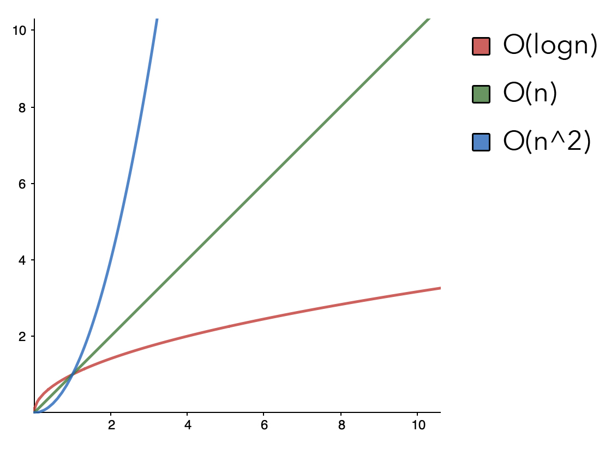

#### [Big O Notation](https://medium.com/@tmakhlay2/what-is-o-n-big-o-notation-how-to-use-it-e3da8592ac0c "My Blog Post for the Article Assignment")


#### [Recursion vs. Iteration](https://medium.com/@asimzaidi/what-is-recursion-what-is-recursion-what-is-recur-dfcfdf51cc21 "By Asim Zaidi")
```Python
"""
Find the factorial of a given number using an iterative function.
"""
def factorial_iterative(n):
   result = 1
   if n == 0 or n == 1:
      return 1
   for i in range(1, n + 1):
      result *= i
   return result

print(factorial_iterative(5)) # 5 * 4 * 3 * 2 * 1 = 120
```

> Recursion does not add value to the program output and rather how a developer digest the code they’re reading. - Asim Zaidi

```Python
"""
Find the factorial of a given number using an recursive function.
"""
def factorial_recursive(n):
   # check if n is one of the base cases
   if n == 0 or n == 1:
      return 1
   # check if n is an integer larger than the base cases
   elif n > 1:
      # call function recursively
      return n * factorial_recursive(n - 1)

print(factorial_recursive(5)) # 5 * 4 * 3 * 2 * 1 = 120
```

#### [Linear Search vs. Binary Search](https://medium.com/@tmakhlay2/what-is-o-n-big-o-notation-how-to-use-it-e3da8592ac0c "My Big O Notation Article on Medium")
Binary Search is an algorithm to sort through sorted data sets. The program begins by making many operations at the beginning but it quickly flatlines. It works by starting in the middle of a sorted list and check if the item is greater or smaller. If it’s greater, it removes the entirety of the smaller data sets. It repeats the process with the remaining data sets.


```Python
"""
Linear Search through unsorted array.
"""
def linear_search(array, n):
    index = 0
    for item in array:
        if item == n:
            return index
        index += 1
    return -1 # Not Found

num_array = [9,7,2,1,3,6,5,4,8]
linear_search(num_array, 9) # Returns index 0
```
> Binary Search is considerably faster than Linear Search when handling larger data inputs.

```Python
"""
Binary Search through sorted array.
"""
def binary_search(array, start, end, x):
# Function from https://www.codesdope.com/course/algorithms-binary-search/
  if(start <= end):
    middle = (start + end) // 2
    if(array[middle] == x):
      return middle

    if(array[middle] > x):
      return binary_search(array, start, middle-1, x)

    if(array[middle] < x):
      return binary_search(array, middle+1, end, x)

  return -1 # not found

num_array = [9,7,2,1,3,6,5,4,8]
num_array.sort() # [1, 2, 3, 4, 5, 6, 7, 8, 9]

binary_search(num_array, 0, len(num_array), 1) # Returns the index of 1 (0)
```

#### [Numeral Systems](https://medium.com/@tmakhlay2/hexadecimal-base-16-numeral-system-14e6a19e58c1 "My Article about numeral systems")


**Think of bases as ticks**, when does the numeral system require the addition of a second symbol to represent a larger number. The way you tick from 9 to 10. You add another symbol, to represent a larger number that could’ve not been represented by a single symbol.
> Base 10 (Hindu-Arabic) our numeral system
```
1
2
3
4
5
6
7
8
9
10
11
12
13
14
15
...etc
```

> Base 2 (Binary)
A base 2 numeral system is what our computers operate by today. It’s easy for computers to operate when whey only need to know if the value is 0 and 1 or also seen as True and False.
```
0: 0
1: 1
2: 10 (we’re full – tick over)
3: 11
4: 100 (we’re full again – tick over)
5: 101
6: 110
7: 111
8: 1000 (tick over again)
```

> Base 16 (Hexadecimal)
Similarly to how base 10 made it easier to display larger numbers than base 2, so is base 16 easier to write than base 10.
```
1
2
3
4
5
6
7
8
9
A (10 – we’re using the symbol “A”)
B (11)
C (12)
D (13)
E (14)
F (15 – uh oh, we’re getting full)
10 (16 – we start a new digit)
```

> **Base 10** : **Base 16** : **Base 2**
```
 0 : 0 : 0000
 1 : 1 : 0001
 2 : 2 : 0010
 3 : 3 : 0011
 4 : 4 : 0100
 5 : 5 : 0101
 6 : 6 : 0110
 7 : 7 : 0111
 8 : 8 : 1000
 9 : 9 : 1001
10 : A : 1010
11 : B : 1011
12 : C : 1100
13 : D : 1101
14 : E : 1110
15 : F : 1111
...
16 : 10: 10000
...
255 : FF : 11111111
```

There's a pattern between Base 16 and Base 2.
Each *Tick* on Base 16 would be matching exactly the *Tick* on a 4-bit on Base 2.

```Python
"""
Decode a digit from any base to base 10 equivalent.
"""
import string
def decode(digits, base):
    """Decode given digits in given base to number in base 10.
    digits: str -- string representation of number (in given base)
    base: int -- base of given number
    return: int -- integer representation of number (in base 10)"""
    # Handle up to base 36 [0-9a-z]
    assert 2 <= base <= 36, 'base is out of range: {}'.format(base)

    # Decode digits from binary (base 2)
    if base is 2:
        answer = 0
        lenght = len(digits) - 1
        for num in digits:
            num = int(num)
            value = num * (base ** lenght)
            lenght -= 1
            answer += value
        return answer

    # Decode digits from hexadecimal (base 16)
    elif base is 16:
        answer = 0
        lenght = len(digits) - 1

        for num in digits:
            if num.isalpha():
                num = num.upper()
                if num == "A":
                    num = 10
                elif num == "B":
                    num = 11
                elif num == "C":
                    num = 12
                if num == "D":
                    num = 13
                if num == "E":
                    num = 14
                if num == "F":
                    num = 15
            num = int(num)

            answer += num * (base ** lenght)
            lenght -= 1
        return answer

    # Decode digits from any base (2 up to 36)
    elif 2 < base <= 36:
        answer = 0
        lenght = len(digits) - 1
        for number in digits:
            if number.isalpha():
                number = number.upper()
                number = string.ascii_uppercase.index(number) + 10
            number = int(number)
            answer += number * (base ** lenght)
            lenght -= 1
        return answer
```

```Python
"""
Encode a base 10 number to its equivalent in any other base (Base between 2-36)
"""
def encode(number, base):
    """Encode given number in base 10 to digits in given base.
    number: int -- integer representation of number (in base 10)
    base: int -- base to convert to
    return: str -- string representation of number (in given base)"""
    # Handle up to base 36 [0-9a-z]
    assert 2 <= base <= 36, 'base is out of range: {}'.format(base)
    # Handle unsigned numbers only for now
    assert number >= 0, 'number is negative: {}'.format(number)

    # Encode number in binary (base 2)
    if base == 2:
        number_array = [number]
        answer = ""

        # Keep the loop until it finished diving it.
        while number > 1:
            number = number // 2
            number_array.append(number)

        # Convert each number in array to one binary number.
        for num in number_array:
            answer = str(num % 2) + answer

        # Return
        return answer

    # Encode number in hexadecimal (base 16)
    elif base == 16:
        hex = ""
        while number > 0:
            hex_num = number % 16
            number = number // 16
            new_hex_value = hex_num
            if hex_num < 10:
                new_hex_value = hex_num
            elif hex_num == 10:
                new_hex_value = "A"
            elif hex_num == 11:
                new_hex_value = "B"
            elif hex_num == 12:
                new_hex_value = "C"
            elif hex_num == 13:
                new_hex_value = "D"
            elif hex_num == 14:
                new_hex_value = "E"
            elif hex_num == 15:
                new_hex_value = "F"

            hex = str(new_hex_value) + hex

        return hex
    # Encode number in any base (2 up to 36)
    elif 2 < base <= 36:
        answer = ""
        while number > 0:
            value = number % base
            number = number // base
            if value >= 10 and value < base:
                value = string.ascii_uppercase[value - 10]
            answer = str(value) + answer
        print(answer)
```
```Python
"""
Convert a digit from any base to any other base. (Between Bases 2-36).
"""
def convert(digits, base1, base2): # Needs encode() and decode() to work.
    """Convert given digits in base1 to digits in base2.
    digits: str -- string representation of number (in base1)
    base1: int -- base of given number
    base2: int -- base to convert to
    return: str -- string representation of number (in base2)"""
    # Handle up to base 36 [0-9a-z]
    assert 2 <= base1 <= 36, 'base1 is out of range: {}'.format(base1)
    assert 2 <= base2 <= 36, 'base2 is out of range: {}'.format(base2)

    return encode(decode(digits, base1), base2)

```
