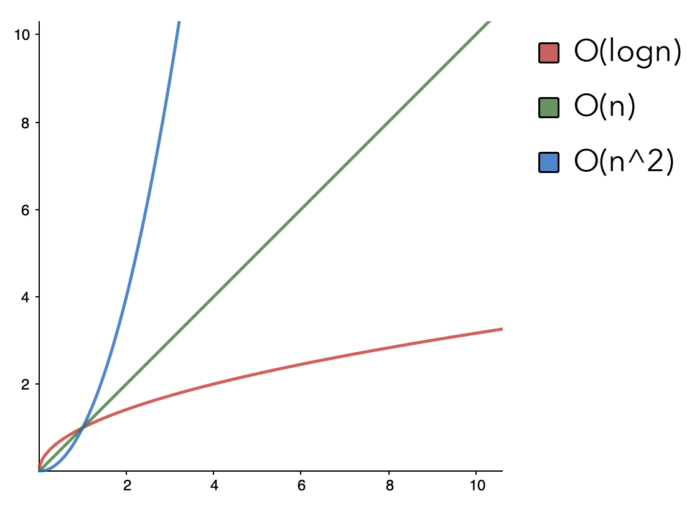

# CS 1.3 Timo's Cheatsheet
**90 Minute test. Paper. No Computer. Diagrams.**
### Writing high-quality code
* Organization and modularity, separation of concerns
* Refactoring code with helper functions (**DRY principle**)
* Defining new classes and instance methods (**OOP in Python**)
* Encapsulation, composition, and inheritance (**OOP concepts**)

### Python programming
* **Data types** (integer, float, and string)
* **Collections** (list, tuple, and dictionary), common operations
* **String manipulation** (indexing, slicing, splitting, and joining)

```Python
"""
String Manipulation
"""
string = "123456789"

for char in string:
  print(char) # 1,2,3,4,5,6...

one_to_five = string[0:5] # "12345"

five_to_nine = string[-5:] # "56789"

reverse_string = string[::-1] # "987654321"
```
### Algorithms
* Algorithm time and space complexity analysis with [**big-O notation**](https://medium.com/@tmakhlay2/what-is-o-n-big-o-notation-how-to-use-it-e3da8592ac0c "My Blog Post for the Article Assignment")
* Recursion, applications to factorial, binary search algorithm, trees, and traversals
* Linear search, binary search (find index of element in array), input assumptions
* String searching (find starting index of pattern in text string), palindrome checking
* Number bases (decoding, encoding, and converting between base 2, 10, and 16)

#### [Big O Notation](https://medium.com/@tmakhlay2/what-is-o-n-big-o-notation-how-to-use-it-e3da8592ac0c "My Blog Post for the Article Assignment")


#### [Recursion vs. Iteration](https://medium.com/@asimzaidi/what-is-recursion-what-is-recursion-what-is-recur-dfcfdf51cc21 "By Asim Zaidi")
```Python
"""
Find the factorial of a given number using an iterative function.
"""
def factorial_iterative(n):
   result = 1
   if n == 0 or n == 1:
      return 1
   for i in range(1, n + 1):
      result *= i
   return result

print(factorial_iterative(5)) # 5 * 4 * 3 * 2 * 1 = 120
```

> Recursion does not add value to the program output and rather how a developer digest the code they’re reading. - Asim Zaidi

```Python
"""
Find the factorial of a given number using an recursive function.
"""
def factorial_recursive(n):
   # check if n is one of the base cases
   if n == 0 or n == 1:
      return 1
   # check if n is an integer larger than the base cases
   elif n > 1:
      # call function recursively
      return n * factorial_recursive(n - 1)

print(factorial_recursive(5)) # 5 * 4 * 3 * 2 * 1 = 120
```

#### Linear Search vs. Binary Search

```Python
"""
Linear Search through unsorted array.
"""
def linear_search(array, n):
    index = 0
    for item in array:
        if item == n:
            return index
        index += 1
    return -1 # Not Found

num_array = [9,7,2,1,3,6,5,4,8]
linear_search(num_array, 9) # Returns index 0
```

```Python
"""
Binary Search through sorted array.
"""
def binary_search(array, start, end, x):
# Function from https://www.codesdope.com/course/algorithms-binary-search/
  if(start <= end):
    middle = (start + end) // 2
    if(array[middle] == x):
      return middle

    if(array[middle] > x):
      return binary_search(array, start, middle-1, x)

    if(array[middle] < x):
      return binary_search(array, middle+1, end, x)

  return -1 # not found

num_array = [9,7,2,1,3,6,5,4,8]
num_array.sort() # [1, 2, 3, 4, 5, 6, 7, 8, 9]

binary_search(num_array, 0, len(num_array), 1) # Returns the index of 1 (0)
```

#### [Numeral Systems](https://medium.com/@tmakhlay2/hexadecimal-base-16-numeral-system-14e6a19e58c1 "My Article about numeral systems")


**Think of bases as ticks**, when does the numeral system require the addition of a second symbol to represent a larger number. The way you tick from 9 to 10. You add another symbol, to represent a larger number that could’ve not been rapresented by a single symbol.
> Base 10 (Hindu-Arabic) our numeral system
```
1
2
3
4
5
6
7
8
9
10
11
12
13
14
15
...etc
```

> Base 2 (Binary)

### Data structures
* **Arrays** (static/fixed-size and dynamic/resizable), operations, automatic resizing
* **Linked lists** (singly-linked only, not doubly-linked), nodes, traversal, operations
* **Hash tables**, operations, hash collision and resolution (chaining with linked lists only, not probing), calculating load factor, automatic resizing and rehashing
* **Binary search trees**, operations, traversals (in-, pre-, post-, and level-order)
* Diagramming how data structures are organized in memory
Performance comparisons between data structures

### Abstract data types (ADTs)
* **List ADT**, stack, queue, operations, implementation with array and linked list
* **Map ADT** (a.k.a. dictionary), operations (contains, get, set, and delete), storing and retrieving key-value entries, implementation with hash table
* **Set ADT**, operations on elements (contains, add, and remove), operations on other sets (intersection, union, difference, and is subset), implementation with dynamic array, sorted array, singly-linked list, hash table, and binary search tree

### Unit testing
* **Reading assertion** failures and stack traces to locate the source of an error
* **Writing assert** statements and unit test functions to ensure correct behavior

# No need to study these:
* Algorithms, data structures, and ADTs **only mentioned briefly or in stretch challenges** (doubly-linked list, deque, circular buffer, hash table collision resolution with probing, self-balancing tree, prefix tree, tree map, multiset, priority queue, heap, graph, etc.)
* **Binary representations of negative numbers** (signed magnitude, ones/twos complement)
* Anagrams, combinations, and permutations
* Python collection iterators and generators
* Reading from and writing to text files
* Word jumble design challenge
* Call routing project

# Resources
* Docs Study Guide - https://docs.google.com/document/d/1eKArEkqP2PoWdx7y2d5CCOrR05yOvH-fHdR32aO-U-k/preview
* Lessons, slides, articles, and videos linked from course repo: [make.sc/cs13-repo](http://make.sc/cs13-repo)
* Data structure and algorithm source code templates in course repo: [make.sc/cs13-repo](http://make.sc/cs13-repo)
* Activity worksheets completed in class (highlight text to see solutions on some of these):
* Number bases worksheet: [make.sc/number-bases-worksheet (CS 1.3)](https://github.com/Make-School-Courses/CS-1.3-Core-Data-Structures/blob/master/Lessons/slides/NumberBasesWorksheet.pdf)
* Linked lists worksheet: [make.sc/linked-lists-worksheet (CS 1.2)](https://docs.google.com/document/d/1hdhCZtQMwFuXs6x_X5lZYjHj47cTkRnqZiFn846J-pE/preview)
* Stacks and queues worksheet: [make.sc/stacks-queues-worksheet (CS 1.3)](https://docs.google.com/document/d/1zRnzN-QCKkejHTEBMzTQhdquY47Cu0JNbTNrliScVnw/preview)
* Hash tables worksheet: [make.sc/hash-tables-worksheet (CS 1.2)](http://make.sc/hash-tables-worksheet)
* Time complexity worksheet: [make.sc/time-complexity-worksheet (CS 1.2)](http://make.sc/time-complexity-worksheet)
* Set operations worksheet: [make.sc/set-operations-worksheet (CS 1.3)](http://make.sc/set-operations-worksheet)
* Trees and tree traversals worksheet: [make.sc/trees-worksheet (CS 1.3)](http://make.sc/trees-worksheet)
* Articles explaining CS concepts in fairly understandable and accessible ways:
* Algorithm analysis article: [make.sc/big-o-notation (InterviewCake)](https://www.interviewcake.com/article/python/big-o-notation-time-and-space-complexity)
* Logarithms article: [make.sc/logarithms-article (InterviewCake)](http://make.sc/logarithms-article)
* Binary search article: [make.sc/binary-search-article (InterviewCake)](http://make.sc/binary-search-article)
* Binary search tree article: [make.sc/binary-search-tree-article(InterviewCake)](http://make.sc/binary-search-article)
* Data structures articles by Vaidehi Joshi linked from each lesson in course repo
* Code Review Rubric (readability and organization of code): [make.sc/code-review-rubric](http://make.sc/code-review-rubric)
* Study tips guide: [make.sc/study-tips](http://make.sc/study-tips)
