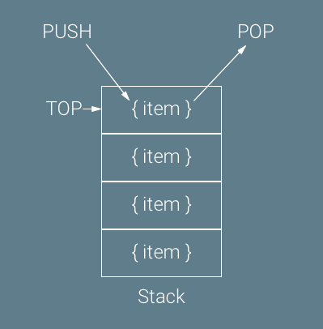
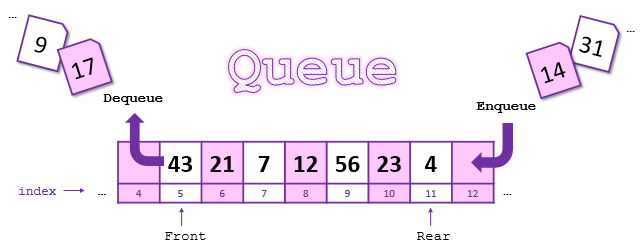
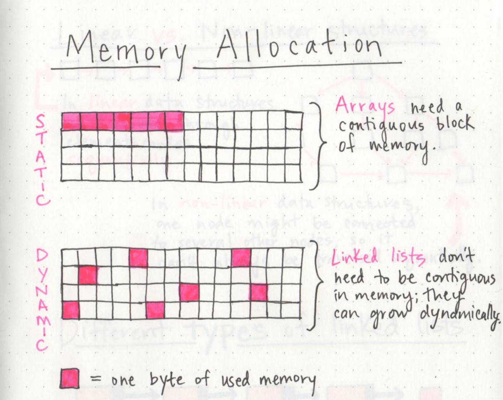

# Abstract data types (ADTs)
* **List ADT**, stack, queue, operations, implementation with array and linked list
* **Map ADT** (a.k.a. dictionary), operations (contains, get, set, and delete), storing and retrieving key-value entries, implementation with hash table
* **Set ADT**, operations on elements (contains, add, and remove), operations on other sets (intersection, union, difference, and is subset), implementation with dynamic array, sorted array, singly-linked list, hash table, and binary search tree

## [Stacks](https://medium.com/@nicolaisafai/what-are-stacks-useful-for-undo-79668042e12b "By Nicolai Safai")
> It's what makes 'cmd' + 'z' a thing.


>Stacks only allow us to push() items to the top of the stack, and pop() the item that was just added.

```Python
# coding: utf-8
#!python

from linkedlist import LinkedList

# Implement LinkedStack below, then change the assignment at the bottom
# to use this Stack implementation to verify it passes all tests
class LinkedStack(object):

    def __init__(self, iterable=None):
        """Initialize this stack and push the given items, if any."""
        # Initialize a new linked list to store the items
        self.list = LinkedList()
        if iterable is not None:
            for item in iterable:
                self.push(item)

    def __repr__(self):
        """Return a string representation of this stack."""
        return 'Stack({} items, top={})'.format(self.length(), self.peek())

    def is_empty(self):
        """Return True if this stack is empty, or False otherwise."""
        # TODO: Check if empty
        return self.list.is_empty()

    def length(self):
        """Return the number of items in this stack."""
        # TODO: Count number of items
        return self.list.length()

    def push(self, item):
        """Insert the given item on the top of this stack.
        Running time: O(???) – Why? [TODO]"""
        # TODO: Push given item
        self.list.prepend(item)

    def peek(self):
        """Return the item on the top of this stack without removing it,
        or None if this stack is empty."""
        # TODO: Return top item, if any
        temp = self.list.head
        if temp != None:
            return temp.data
        else:
            return None

    def pop(self):
        """Remove and return the item on the top of this stack,
        or raise ValueError if this stack is empty.
        Running time: O(???) – Why? [TODO]"""
        # TODO: Remove and return top item, if any
        temp = self.list.head
        if temp != None:
            self.list.delete(temp.data) # O(n)
            return temp.data
        else:
            raise ValueError("Empty list")

# Implement ArrayStack below, then change the assignment at the bottom
# to use this Stack implementation to verify it passes all tests
class ArrayStack(object):

    def __init__(self, iterable=None):
        """Initialize this stack and push the given items, if any."""
        # Initialize a new list (dynamic array) to store the items
        self.list = list()
        if iterable is not None:
            for item in iterable:
                self.push(item)

    def __repr__(self):
        """Return a string representation of this stack."""
        return 'Stack({} items, top={})'.format(self.length(), self.peek())

    def is_empty(self):
        """Return True if this stack is empty, or False otherwise."""
        # TODO: Check if empty
        if self.length() == 0:
            return True
        else:
            return False

    def length(self):
        """Return the number of items in this stack."""
        # TODO: Count number of items
        return len(self.list)

    def push(self, item):
        """Insert the given item on the top of this stack.
        Running time: O(???) – Why? [TODO]"""
        # TODO: Insert given item
        self.list.append(item) # end of the list

    def peek(self):
        """Return the item on the top of this stack without removing it,
        or None if this stack is empty."""
        # TODO: Return top item, if any
        if self.is_empty() == False:
            return self.list[-1]
        else:
            return None

    def pop(self):
        """Remove and return the item on the top of this stack,
        or raise ValueError if this stack is empty.
        Running time: O(???) – Why? [TODO]"""
        # TODO: Remove and return top item, if any
        if self.is_empty() == False:
            temp = self.list[-1]
            self.list.pop()
            return temp
        else:
            raise ValueError("Empty list")
```

## Queue


```Python
# coding: utf-8
#!python

from linkedlist import LinkedList


# Implement LinkedQueue below, then change the assignment at the bottom
# to use this Queue implementation to verify it passes all tests
class LinkedQueue(object):

    def __init__(self, iterable=None):
        """Initialize this queue and enqueue the given items, if any."""
        # Initialize a new linked list to store the items
        self.list = LinkedList()
        if iterable is not None:
            for item in iterable:
                self.enqueue(item)

    def __repr__(self):
        """Return a string representation of this queue."""
        return 'Queue({} items, front={})'.format(self.length(), self.front())

    def is_empty(self):
        """Return True if this queue is empty, or False otherwise."""
        # TODO: Check if empty
        return self.list.is_empty()

    def length(self):
        """Return the number of items in this queue."""
        # TODO: Count number of items
        return self.list.length()

    def enqueue(self, item):
        """Insert the given item at the back of this queue.
        Running time: O(???) – Why? [TODO]"""
        # TODO: Insert given item
        self.list.append(item)

    def front(self):
        """Return the item at the front of this queue without removing it,
        or None if this queue is empty."""
        # TODO: Return front item, if any
        if self.is_empty() == True:
            return None
        else:
            return self.list.head.data

    def dequeue(self):
        """Remove and return the item at the front of this queue,
        or raise ValueError if this queue is empty.
        Running time: O(???) – Why? [TODO]"""
        # TODO: Remove and return front item, if any
        if self.is_empty() == True:
            raise ValueError("queue is empty")
        else:
            temp = self.list.head.data
            self.list.delete(temp)
            return temp


# Implement ArrayQueue below, then change the assignment at the bottom
# to use this Queue implementation to verify it passes all tests
class ArrayQueue(object):

    def __init__(self, iterable=None):
        """Initialize this queue and enqueue the given items, if any."""
        # Initialize a new list (dynamic array) to store the items
        self.list = list()
        if iterable is not None:
            for item in iterable:
                self.enqueue(item)

    def __repr__(self):
        """Return a string representation of this queue."""
        return 'Queue({} items, front={})'.format(self.length(), self.front())

    def is_empty(self):
        """Return True if this queue is empty, or False otherwise."""
        # TODO: Check if empty

    def length(self):
        """Return the number of items in this queue."""
        # TODO: Count number of items

    def enqueue(self, item):
        """Insert the given item at the back of this queue.
        Running time: O(???) – Why? [TODO]"""
        # TODO: Insert given item

    def front(self):
        """Return the item at the front of this queue without removing it,
        or None if this queue is empty."""
        # TODO: Return front item, if any

    def dequeue(self):
        """Remove and return the item at the front of this queue,
        or raise ValueError if this queue is empty.
        Running time: O(???) – Why? [TODO]"""
        # TODO: Remove and return front item, if any
```

## Linkedlist vs Array

> LinkedLists do not use contiguous memory. Linked Lists never have to make a copy of themselves; they can grow indefinitely. So using them is slightly more optimal from a time complexity perspective. However, LinkedLists require each item to know the memory address of the next item in the list, so they take a bit of extra space.
