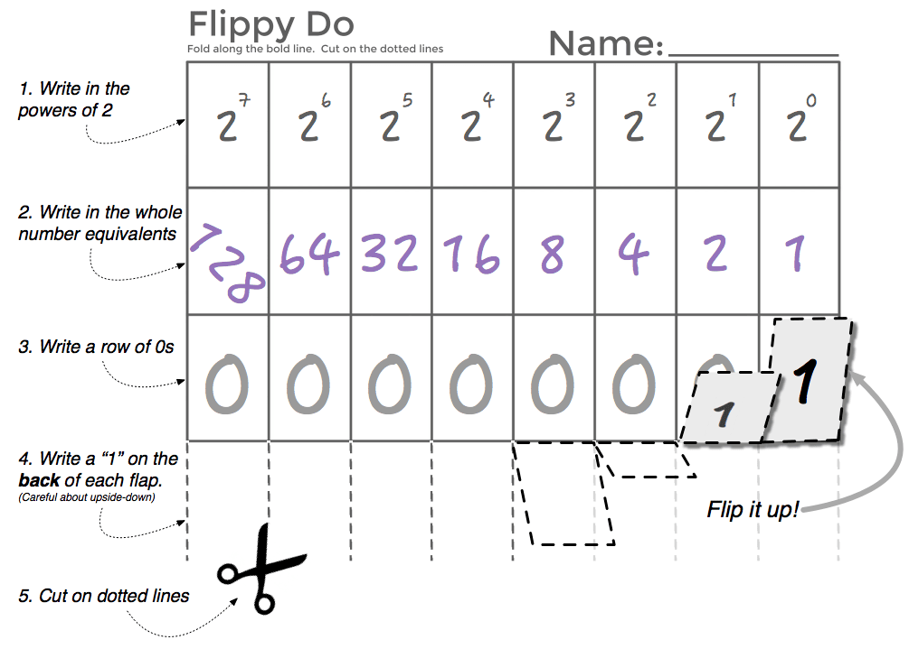
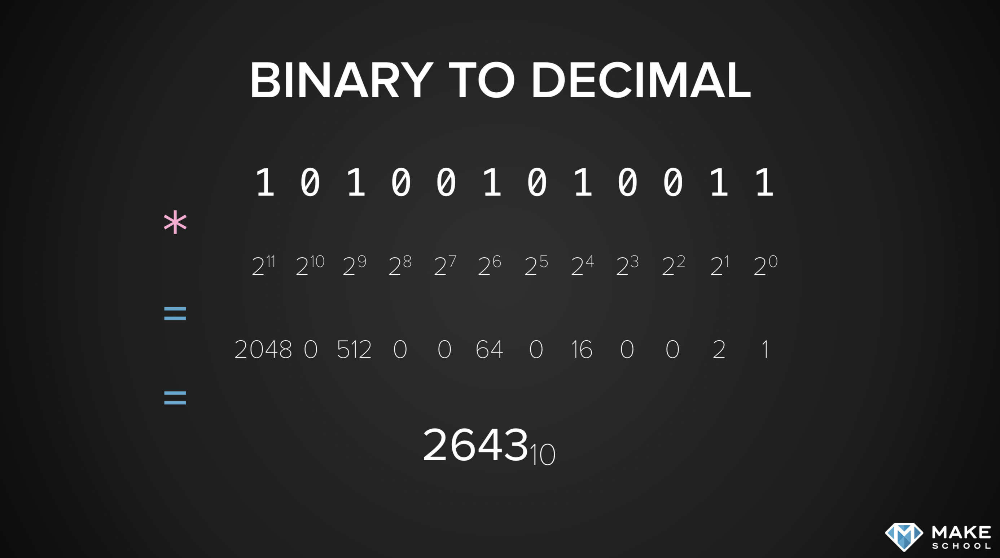
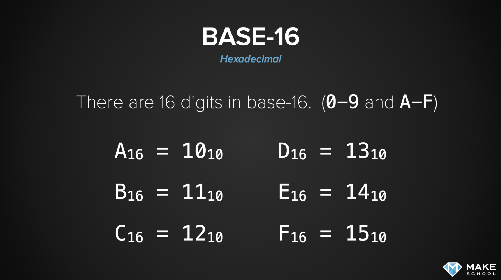

# Number Bases
> I didn't take a lot of notes cause I wrote an article on the topic. I've only annotated the fundamentals on this page.
[My Article on numeral bases](https://medium.com/@tmakhlay2/hexadecimal-base-16-numeral-system-14e6a19e58c1 "My Article about numeral systems")

## Flippy Do
> Simplified Binary Conversion manually



[Online Base Converter](https://www.baseconvert.com)

# Why do we use base-10?
> Because we have 10 fingers and it makes it easy.

> Our fingers are called digits, it's not just a coincidence.

# What is Binary?
> A base 2 numeral system

* Easy for computers cause they only need to know if it's True or False.
* Only 1 and 0 (True and False)
* Not very readable or usable for humans.

> There's only 10 types of people in the world. Those that get binary and those that don't.



# What is Hexadecimal?
> Hexadecimal or Hex for short, is a base 16 numeral system.

* `#000000` is White
* `#FF0000` is Red
* `#00FF00` is Green
* `#0000FF` is Blue
* `#FFFFFF` is Black

> RGB is 255-255-255 and is translated to Hex to shorten it.

### Base 10 to Hexadecimal


> Binary and Hexadecimal work very well together.

Four bits of binary can be converted to its Hexadecimal equivalent.
They `tick` at the same values.

```
Base 10 : Base 16: Base 2
 0 : 0 : 0000 0000
 1 : 1 : 0000 0001
 2 : 2 : 0000 0010
 3 : 3 : 0000 0011
 4 : 4 : 0000 0100
 5 : 5 : 0000 0101
 6 : 6 : 0000 0111
 7 : 7 : 0000 1000
 8 : 8 : 0000 1001
 9 : 9 : 0000 1011
10 : A : 0000 1111
11 : B : 0001 0000
12 : C : 0001 0001
13 : D : 0001 0011
14 : E : 0001 0111
15 : F : 0001 1111
16 : 10: 0010 0000
...
255 : FF : 11111111
```

# Homework

bases.py ([link](https://github.com/timomak/CS-1.3/blob/master/Try%20again/bases.py))

#### Code:
```Python
#!python

import string
import math
# Hint: Use these string constants to encode/decode hexadecimal digits and more
# string.digits is '0123456789'
# string.hexdigits is '0123456789abcdefABCDEF'
# string.ascii_lowercase is 'abcdefghijklmnopqrstuvwxyz'
# string.ascii_uppercase is 'ABCDEFGHIJKLMNOPQRSTUVWXYZ'
# string.ascii_letters is ascii_lowercase + ascii_uppercase
# string.printable is digits + ascii_letters + punctuation + whitespace

int_to_string = string.digits + string.ascii_lowercase

str_to_int = {string: index for index, string in enumerate(int_to_string)}

def decode(digits, base):
    """Decode given digits in given base to number in base 10.
    digits: str -- string representation of number (in given base)
    base: int -- base of given number
    return: int -- integer representation of number (in base 10)"""
    # Handle up to base 36 [0-9a-z]
    assert 2 <= base <= 36, 'base is out of range: {}'.format(base)
    # Thank you Connor https://github.com/Connor-Cahill/CS-1.3-Core-Data-Structures/blob/master/Lessons/source/bases.py

    dec_sum = 0
    # i = index and v = value
    for i, v in enumerate(reversed(digits)):
        # str_to_int[v] will return the string (v) as an int.
        # This formula will convert any single string item to its base 10 counnterpart.
        dec_sum += ( base ** i ) * str_to_int[v]
    return dec_sum

# New Code
def encode(number, base):
    '''
    GIVEN NUMBER (BASE10) -> DIGITS IN GIVEN BASE
    '''
    # Handle up to base 36 [0-9a-z]
    assert 2 <= base <= 36, 'base is out of range: {}'.format(base)
    # Handle unsigned numbers only for now
    assert number >= 0, 'number is negative: {}'.format(number)

    num = number
    output = ""
    while num > 0:
        remainder = num % base
        # VALUE BY INDEX
        output += string.printable[remainder]
        # ROUNDED DIVISION
        num = num // base
    return output[::-1]

def convert(digits, base1, base2):
    """Convert given digits in base1 to digits in base2.
    digits: str -- string representation of number (in base1)
    base1: int -- base of given number
    base2: int -- base to convert to
    return: str -- string representation of number (in base2)"""
    # Handle up to base 36 [0-9a-z]
    assert 2 <= base1 <= 36, 'base1 is out of range: {}'.format(base1)
    assert 2 <= base2 <= 36, 'base2 is out of range: {}'.format(base2)

    return encode(decode(digits, base1), base2)


def main():
    """Read command-line arguments and convert given digits between bases."""
    import sys
    args = sys.argv[1:]  # Ignore script file name
    if len(args) == 3:
        digits = args[0]
        base1 = int(args[1])
        base2 = int(args[2])
        # Convert given digits between bases
        result = convert(digits, base1, base2)
        # print(result)
        # return result

        print('{} in base {} is {} in base {}'.format(digits, base1, result, base2))
    else:
        print('Usage: {} digits base1 base2'.format(sys.argv[0]))
        print('Converts digits from base1 to base2')

if __name__ == '__main__':
    main()
    # print(25 // 20)
    # encode(14, 14)
    # decode("J", 20)
```
