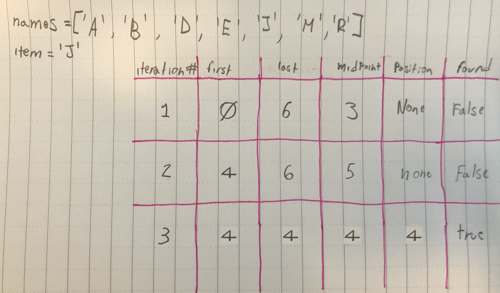

# Recursion & Search Algorithms
Github Lesson 2 ([link](https://github.com/Make-School-Courses/CS-1.3-Core-Data-Structures/blob/master/Lessons/RecursionSearchAlgorithms.md))

### I Ching Secret Code
This is a secret code. Try to find the secret it finds!


HackerNoon Article on this ([link](https://hackernoon.com/bringing-a-classic-ancient-binary-encoding-back-to-the-future-17f79508400e))

> Encoding of “Freeconnectivityfortheworld” using iching.codes

# Binary and Linear Search


### Differences between the two:
* Linear
  * Checks all the items from left to right
  * It will stop when it finds the value or when it runs out of numbers
* Binary
  * Only works on sorted arrays
  * Starts at the middle
  * If the item is not the middle item, it will ignore half the list
    * If the item is larger than the middle, we ignore everything to the left including the middle
    * If it's less than the middle, we ignore the right including the middle

## Time Complexities
#### Linear Search


#### Binary Search


* If the array is short, linear search might be a lot faster.
* Binary Search works best with a longer array and if the item is not in the front of the array.
* The array has to be sorted on a binary search.


```Python
"""
Binary Search through sorted array using a recursive function.
"""
def binary_search(array, start, end, x):
# Function from https://www.codesdope.com/course/algorithms-binary-search/
  if(start <= end):
    middle = (start + end) // 2
    if(array[middle] == x):
      return middle

    if(array[middle] > x):
      return binary_search(array, start, middle-1, x)

    if(array[middle] < x):
      return binary_search(array, middle+1, end, x)

  return -1 # not found

num_array = [9,7,2,1,3,6,5,4,8]
num_array.sort() # [1, 2, 3, 4, 5, 6, 7, 8, 9]

binary_search(num_array, 0, len(num_array), 1) # Returns the index of 1 (0)
```

> In Class Iteration Visual <br>


# Factorial
> Example.

```
12! == 12 x 11 x 10 x 9 x 8 x 7 x 5 x 4 x 3 x 2 x 1
```

## Different Combinations

> In class example.

```Python
# Let's say we have an array with 3 items
letters = ['a', 'b', 'c']

# How many Different Order Combinations can be made with these 3 items?

"""
  abc
  acb

  bac
  bca

  cba
  cab
"""

# 6 Different combinations or 3! (3 factorial)

print(3!) # Will return 6 (or 3 x 2 x 1)
```

## Recursive Factorial Function
> In class example.

```Python
def factorial(n):
  while n > 0:
    return n * factorial(n - 1) # Calls on itself.

print(factorial(5)) # Will print 120
```


# Homework
- Implement iterative [factorial](https://en.wikipedia.org/wiki/Factorial) function using [recursion starter code](https://github.com/Make-School-Courses/CS-1.3-Core-Data-Structures/blob/master/Code/recursion.py):
    - Implement `factorial(n)` - the product of all integers 1 through `n`
    - Run `python recursion.py number` to test `factorial` on a number
        - Example: `python recursion.py 8` gives the result `factorial(8) => 40320`
    - Run `pytest recursion_test.py` to run the [recursion unit tests](https://github.com/Make-School-Courses/CS-1.3-Core-Data-Structures/blob/master/Code/recursion_test.py) and fix any failures
- Implement recursive linear and binary search algorithms using [search starter code](https://github.com/Make-School-Courses/CS-1.3-Core-Data-Structures/blob/master/Code/search.py):
    - Implement `linear_search(array, item)` - the first index of `item` in `array`
    - Implement `binary_search(array, item)` - the index of `item` in sorted `array`
    - Run `pytest search_test.py` to run the [search unit tests](https://github.com/Make-School-Courses/CS-1.3-Core-Data-Structures/blob/master/Code/search_test.py) and fix any failures
- Annotate functions with complexity analysis of running time and space (memory)

## Stretch Challenges
- Implement recursive [permutation](https://en.wikipedia.org/wiki/Permutation) and [combination](https://en.wikipedia.org/wiki/Combination) functions
- Make these functions efficient by avoiding repeated subproblems
- Write your own unit tests to ensure your algorithms are robusts
