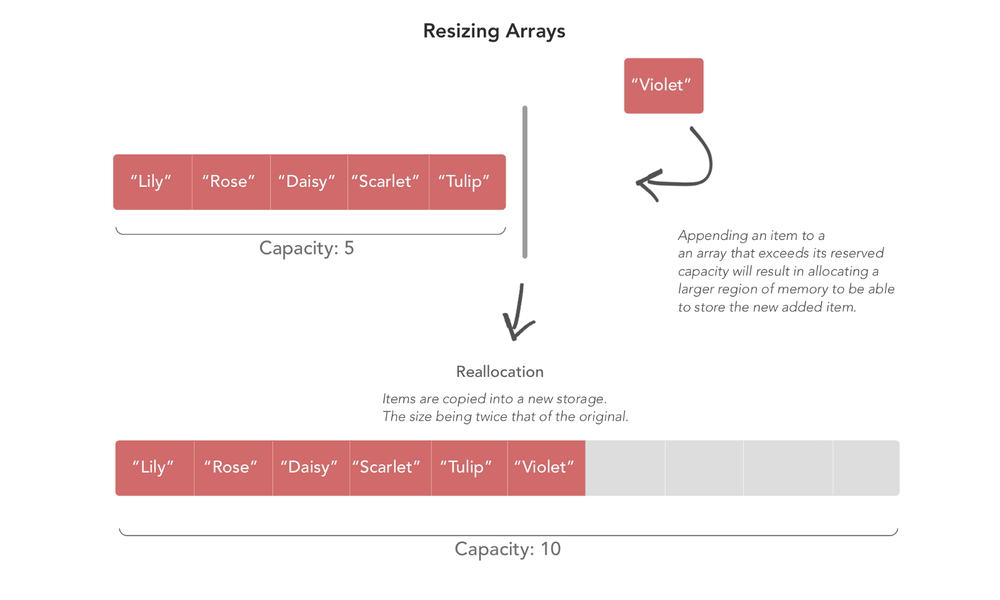
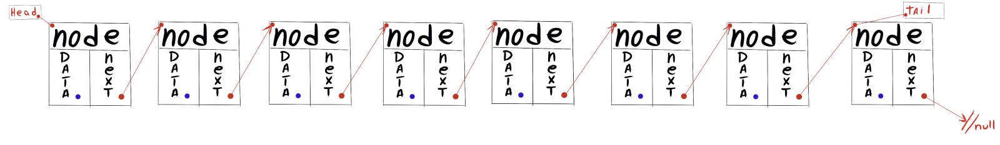
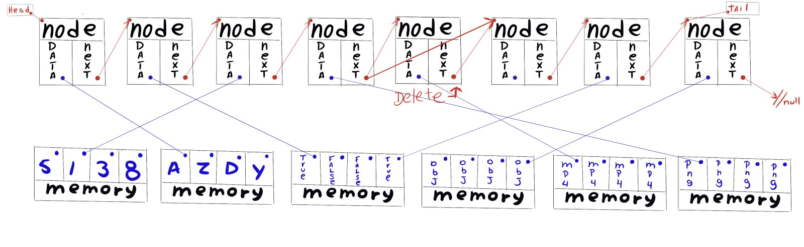
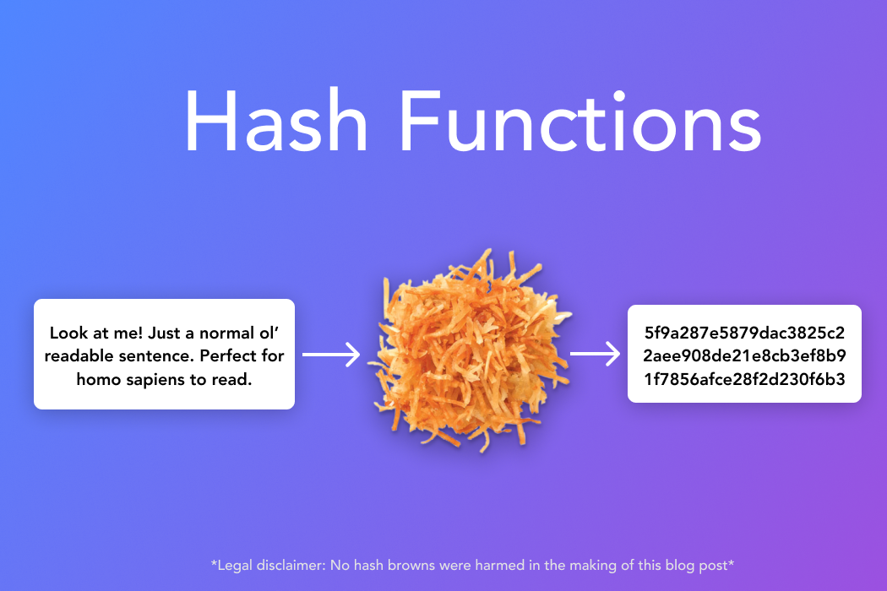
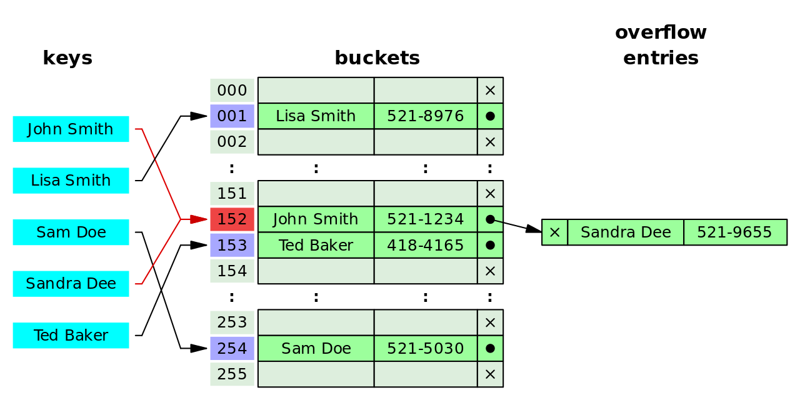

# Data structures
* **Arrays** (static/fixed-size and dynamic/resizable), operations, automatic resizing
* **Linked lists** (singly-linked only, not doubly-linked), nodes, traversal, operations
* **Hash tables**, operations, hash collision and resolution (chaining with linked lists only, not probing), calculating load factor, automatic resizing and rehashing
* **Binary search trees**, operations, traversals (in-, pre-, post-, and level-order)
* Diagramming how data structures are organized in memory
Performance comparisons between data structures

## [Arrays](https://medium.com/@rinradaswift/diving-into-data-structures-in-swift-arrays-4ffd516bde9b "Article bySarin Swift")
> Static - Memory allocated once, size can't change.

> Dynamic - New memory allocated, array copied to grow.



### All you need to know is mutable and immutable arrays.
```Python
array = [1,2] # Mutable [Can change items]
tuple = (1,2) # Immutable [Cannot change items]
```

### **Operations on Arrays** [ *By Rinni Swift*](https://medium.com/@rinradaswift/diving-into-data-structures-in-swift-arrays-4ffd516bde9b "Article bySarin Swift")

#### Adding
* ```append(_:)``` adds a single item to the end of the array.
* ```append(contentsOf: )``` adds multiple elements in the given parameter to the end of the array.
* ```insert(_:at:)``` inserts an item at the given index.
* ```insert(contentsOf:at:)``` inserts multiple elements at the given index.

> This is for dynamic arrays — arrays that can expand as elements are added to it.

#### Removing
* ```remove(at:)```, removes and returns item at given index in the array.
* ```removeFirst()```, removes and returns first item in the array.
* ```removeLast()```, removes and returns last item in the array.
* ```removeAll()```, ```removeAll(keepingCapacity:)```, removes all items in the array and capacity is down to 0 unless declared to keep capacity with true.
* ```removeSubrange(_:)```, removes all elements within the range and shifts elements after that to fill it’s positions.
* ```popLast()```, removes and return last item in the array.

## [Linked List](https://medium.com/@RGero215/linked-lists-4f13f99be10f "By Ramon")

### Methods defined in a linked list:
* ```self.head```: The first Node in list.
* ```self.size```: Count of all nodes.
* ```self.tail```: Last node in list
* ```items()```: Return a list of all items in the linked list.
* ```is_empty()```: Return true if the linked list is empty or false otherwise.
* ```length()```: Return the length of the linked list.
* ```get_at_index(index)```: Return the item at the given index or raise a value error if the given index is out of range of the size.
* ```insert_at_index(index, item)```: Insert the given item at the given index or raise a value error if the given index is out of range.
* ```append(item)```: Insert the given item at the tail of the linked list.
* ```prepend(item)```: Insert the given item at the head of the linked list.
* ```find(quality)```: Return an item from the linked list satisfying the given quality. In this case, quality can be anything (ex. quality = chocolate, when going for ice cream and asking for any flavor that has chocolate in it and the return can be chocolate chip ice cream if it’s available in the linked list)
* ```replace(old_item, new_item)```: Replace the given old_item with a given new_item or raise a value error if the old_item is not found.
* ```delete(item)```: delete the given item from the linked list or raise a value error if the item is not found.

```Python
def find(self, quality):
    """Return an item from this linked list satisfying the given quality.
    Best case running time: Omega(1) if item is near the head of the list.
    Worst case running time: O(n) if item is near the tail of the list or
    not present and we need to loop through all n nodes in the list."""
    # Start at the head node
    node = self.head  # Constant time to assign a variable reference
    # Loop until the node is None, which is one node too far past the tail
    while node is not None:  # Up to n iterations if we don't exit early
        # Check if this node's data satisfies the given quality function
        if quality(node.data):  # Constant time to call quality function
            # We found data satisfying the quality function, so exit early
            return node.data  # Constant time to return data
        # Skip to the next node
        node = node.next  # Constant time to reassign a variable
    # We never found data satisfying quality, but have to return something
    return None  # Constant time to return None
```
```Python
def replace(self, old_item, new_item):
      """Replace the given old_item in this linked list with given new_item
      using the same node, or raise ValueError if old_item is not found.
      Best case running time: ??? under what conditions? [TODO]
      Worst case running time: ??? under what conditions? [TODO]"""
      # Check if the list has items.
      if self.size > 0:
          # Base nodes
          node = self.head
          # If the list does have items
          found = False
          # while loop until found == True
          while found == False:
              # Loop through nexts until the data matches
              if old_item == node.data:
                  # Replace the node.data with the new data.
                  node.data = new_item
                  found = True
              # Else iterate
              else:
                  node = node.next
                  if node.next == None:
                      if old_item == node.data:
                          # Replace the node.data with the new data.
                          node.data = new_item
                          found = True
                      # Else iterate
                      else:
                          raise ValueError("Item not in list")

      # Else raise error
      else:
          raise ValueError('List is empty')
```

```Python
def delete(self, item):
        """Delete the given item from this linked list, or raise ValueError.
        Best case running time: ??? under what conditions? [TODO]
        Worst case running time: ??? under what conditions? [TODO]"""
        self.size -= 1
        # Start at the head node
        node = self.head
        # Keep track of the node before the one containing the given item
        previous = None
        # Create a flag to track if we have found the given item
        found = False
        # Loop until we have found the given item or the node is None
        while not found and node is not None:
            # Check if the node's data matches the given item
            if node.data == item:
                # We found data matching the given item, so update found flag
                found = True
            else:
                # Skip to the next node
                previous = node
                node = node.next
        # Check if we found the given item or we never did and reached the tail
        if found:
            # Check if we found a node in the middle of this linked list
            if node is not self.head and node is not self.tail:
                # Update the previous node to skip around the found node
                previous.next = node.next
                # Unlink the found node from its next node
                node.next = None
            # Check if we found a node at the head
            if node is self.head:
                # Update head to the next node
                self.head = node.next
                # Unlink the found node from the next node
                node.next = None
            # Check if we found a node at the tail
            if node is self.tail:
                # Check if there is a node before the found node
                if previous is not None:
                    # Unlink the previous node from the found node
                    previous.next = None
                # Update tail to the previous node regardless
                self.tail = previous
        else:
            # Otherwise raise an error to tell the user that delete has failed
            raise ValueError('Item not found: {}'.format(item))
```
```Python
#!python

class Node(object):

    def __init__(self, data):
        """Initialize this node with the given data."""
        self.data = data
        self.next = None

    def __repr__(self):
        """Return a string representation of this node."""
        return 'Node({!r})'.format(self.data)


class LinkedList(object):

    def __init__(self, iterable=None):
        """Initialize this linked list and append the given items, if any."""
        self.head = None  # First node
        self.tail = None  # Last node
        self.size = 0  # Number of nodes
        # Append the given items
        if iterable is not None:
            for item in iterable:
                self.append(item)

    def __str__(self):
        """Return a formatted string representation of this linked list."""
        items = ['({!r})'.format(item) for item in self.items()]
        return '[{}]'.format(' -> '.join(items))

    def __repr__(self):
        """Return a string representation of this linked list."""
        return 'LinkedList({!r})'.format(self.items())

    def items(self):
        """Return a list of all items in this linked list.
        Best and worst case running time: Theta(n) for n items in the list
        because we always need to loop through all n nodes."""
        # Create an empty list of results
        result = []  # Constant time to create a new list
        # Start at the head node
        node = self.head  # Constant time to assign a variable reference
        # Loop until the node is None, which is one node too far past the tail
        while node is not None:  # Always n iterations because no early exit
            # Append this node's data to the results list
            result.append(node.data)  # Constant time to append to a list
            # Skip to the next node
            node = node.next  # Constant time to reassign a variable
        # Now result contains the data from all nodes
        return result  # Constant time to return a list

    def is_empty(self):
        """Return True if this linked list is empty, or False."""
        return self.head is None

    def length(self):
        """Return the length of this linked list by traversing its nodes.
        Best and worst case running time: ??? under what conditions? [TODO]"""
        # Node counter initialized to zero
        node_count = 0
        # Start at the head node
        node = self.head
        # Loop until the node is None, which is one node too far past the tail
        while node is not None:
            # Count one for this node
            node_count += 1
            # Skip to the next node
            node = node.next
        # Now node_count contains the number of nodes
        return node_count

    def get_at_index(self, index):
        """Return the item at the given index in this linked list, or
        raise ValueError if the given index is out of range of the list size.
        Best case running time: ??? under what conditions? [TODO]
        Worst case running time: ??? under what conditions? [TODO]"""
        # Check if the given index is out of range and if so raise an error
        if not (0 <= index < self.size):
            raise ValueError('List index out of range: {}'.format(index))
        # TODO: Find the node at the given index and return its data

        # Checking if the list has any items.
        if self.size > 0:

            # Setting the head to be the first node to search
            node = self.head
            counter = 0

            # Loop until the counter is the index and return the item at that index.
            while counter <= index: # Big O(n) Notation
                if counter == index:
                    return node.data
                else:
                    # if the current node is not at the index, check if the next one is.
                    if node.next != None:
                        node = node.next
                        counter += 1
                    else:
                        raise ValueError('List index out of range: {}'.format(index))
        else:
            raise ValueError('The list is empty')


    def insert_at_index(self, index, item):
        """Insert the given item at the given index in this linked list, or
        raise ValueError if the given index is out of range of the list size.
        Best case running time: ??? under what conditions? [TODO]
        Worst case running time: ??? under what conditions? [TODO]"""
        # Check if the given index is out of range and if so raise an error
        if not (0 <= index <= self.size):
            raise ValueError('List index out of range: {}'.format(index))
        # TODO: Find the node before the given index and insert item after it


        if index == self.size:
            self.append(item)
            return

        if index == 0:
            self.prepend(item)
            return

        # Check if the list has items
        if self.size > 0:
            # Save the current node and the one before that
            node_at_index = self.head
            node_before_index = Node("")
            # Loop until you reach the current index.
            counter = 0
            while counter <= index: # Big O(n)
                # Replace the .next on the node before.
                if counter == index:
                    new_node = Node(data=item)
                    new_node.next = node_at_index
                    node_before_index.next = new_node
                    self.size += 1
                    # print("You have successfully inserted {} after {} at index {}".format(node_at_index, node_before_index, counter))
                    counter += 1
                else:
                    # Set your new node.next to the one at the current index.
                    node_before_index = node_at_index
                    if node_at_index.next != None:
                        node_at_index = node_at_index.next
                        counter += 1
                    else:
                        # check if the last item is the item we're looking for.
                        if counter == index:
                            new_node = Node(data=item)
                            # No need
                            # new_node.next = node_at_index
                            node_before_index.next = new_node
                            # print("You have successfully inserted {} after {} at index {}".format(node_at_index, node_before_index, counter))
                            return
                        else:
                            raise ValueError('List index out of range: {}'.format(index))


    def append(self, item):
        """Insert the given item at the tail of this linked list.
        Best and worst case running time: ??? under what conditions? [TODO]"""
        self.size += 1
        # Create a new node to hold the given item
        new_node = Node(item)
        # Check if this linked list is empty
        if self.is_empty():
            # Assign head to new node
            self.head = new_node
        else:
            # Otherwise insert new node after tail
            self.tail.next = new_node
        # Update tail to new node regardless
        self.tail = new_node

    def prepend(self, item):
        """Insert the given item at the head of this linked list.
        Best and worst case running time: ??? under what conditions? [TODO]"""
        self.size += 1
        # Create a new node to hold the given item
        new_node = Node(item)
        # Check if this linked list is empty
        if self.is_empty():
            # Assign tail to new node
            self.tail = new_node
        else:
            # Otherwise insert new node before head
            new_node.next = self.head
        # Update head to new node regardless
        self.head = new_node

    def find(self, quality):
        """Return an item from this linked list satisfying the given quality.
        Best case running time: Omega(1) if item is near the head of the list.
        Worst case running time: O(n) if item is near the tail of the list or
        not present and we need to loop through all n nodes in the list."""
        # Start at the head node
        node = self.head  # Constant time to assign a variable reference
        # Loop until the node is None, which is one node too far past the tail
        while node is not None:  # Up to n iterations if we don't exit early
            # Check if this node's data satisfies the given quality function
            if quality(node.data):  # Constant time to call quality function
                # We found data satisfying the quality function, so exit early
                return node.data  # Constant time to return data
            # Skip to the next node
            node = node.next  # Constant time to reassign a variable
        # We never found data satisfying quality, but have to return something
        return None  # Constant time to return None

    def replace(self, old_item, new_item):
        """Replace the given old_item in this linked list with given new_item
        using the same node, or raise ValueError if old_item is not found.
        Best case running time: ??? under what conditions? [TODO]
        Worst case running time: ??? under what conditions? [TODO]"""
        # TODO: Find the node containing the given old_item and replace its
        # data with new_item, without creating a new node object

        # Check if the list has items.
        if self.size > 0:
            # Base nodes
            node = self.head
            # If the list does have items
            found = False
            # while loop until found == True
            while found == False:
                # Loop through nexts until the data matches
                if old_item == node.data:
                    # Replace the node.data with the new data.
                    node.data = new_item
                    found = True
                # Else iterate
                else:
                    node = node.next
                    if node.next == None:
                        if old_item == node.data:
                            # Replace the node.data with the new data.
                            node.data = new_item
                            found = True
                        # Else iterate
                        else:
                            raise ValueError("Item not in list")

        # Else raise error
        else:
            raise ValueError('List is empty')
    def delete(self, item):
        """Delete the given item from this linked list, or raise ValueError.
        Best case running time: ??? under what conditions? [TODO]
        Worst case running time: ??? under what conditions? [TODO]"""
        self.size -= 1
        # Start at the head node
        node = self.head
        # Keep track of the node before the one containing the given item
        previous = None
        # Create a flag to track if we have found the given item
        found = False
        # Loop until we have found the given item or the node is None
        while not found and node is not None:
            # Check if the node's data matches the given item
            if node.data == item:
                # We found data matching the given item, so update found flag
                found = True
            else:
                # Skip to the next node
                previous = node
                node = node.next
        # Check if we found the given item or we never did and reached the tail
        if found:
            # Check if we found a node in the middle of this linked list
            if node is not self.head and node is not self.tail:
                # Update the previous node to skip around the found node
                previous.next = node.next
                # Unlink the found node from its next node
                node.next = None
            # Check if we found a node at the head
            if node is self.head:
                # Update head to the next node
                self.head = node.next
                # Unlink the found node from the next node
                node.next = None
            # Check if we found a node at the tail
            if node is self.tail:
                # Check if there is a node before the found node
                if previous is not None:
                    # Unlink the previous node from the found node
                    previous.next = None
                # Update tail to the previous node regardless
                self.tail = previous
        else:
            # Otherwise raise an error to tell the user that delete has failed
            raise ValueError('Item not found: {}'.format(item))
```
## [Hash tables](https://medium.com/@ryan.dphu.nguyen/using-hash-tables-to-store-my-cards-7b1ce3e7f561 "By Ryan Nguyen")

> A hash function is any function that can be used to map data of arbitrary size onto data of a fixed size.


A hash function will convert data into hash. The hash will be sorted into the appropriate bucket using ```hash(key) % len(self.buckets)```. The bucket will append the item.

```Python  
#!python

from linkedlist import LinkedList


class HashTable(object):

    def __init__(self, init_size=8):
        """Initialize this hash table with the given initial size."""
        self.buckets = [LinkedList() for i in range(init_size)]
        self.size = 0  # Number of key-value entries

    def __str__(self):
        """Return a formatted string representation of this hash table."""
        items = ['{!r}: {!r}'.format(key, val) for key, val in self.items()]
        return '{' + ', '.join(items) + '}'

    def __repr__(self):
        """Return a string representation of this hash table."""
        return 'HashTable({!r})'.format(self.items())

    def _bucket_index(self, key):
        """Return the bucket index where the given key would be stored."""
        return hash(key) % len(self.buckets)

    def load_factor(self):
        """Return the load factor, the ratio of number of entries to buckets.
        Best and worst case running time: ??? under what conditions? [TODO]"""
        # TODO: Calculate load factor
        return self.size / len(self.buckets)

    def keys(self):
        """Return a list of all keys in this hash table.
        Best and worst case running time: ??? under what conditions? [TODO]"""
        # Collect all keys in each of the buckets
        all_keys = []
        for bucket in self.buckets:
            for key, value in bucket.items():
                all_keys.append(key)
        return all_keys

    def values(self):
        """Return a list of all values in this hash table.
        Best and worst case running time: ??? under what conditions? [TODO]"""
        # Collect all values in each of the buckets
        all_values = []
        for bucket in self.buckets:
            for key, value in bucket.items():
                all_values.append(value)
        return all_values

    def items(self):
        """Return a list of all entries (key-value pairs) in this hash table.
        Best and worst case running time: ??? under what conditions? [TODO]"""
        # Collect all pairs of key-value entries in each of the buckets
        all_items = []
        for bucket in self.buckets:
            all_items.extend(bucket.items())
        return all_items

    def length(self):
        """Return the number of key-value entries by traversing its buckets.
        Best and worst case running time: ??? under what conditions? [TODO]"""
        # # Count number of key-value entries in each of the buckets
        # item_count = 0
        # for bucket in self.buckets:
        #     item_count += bucket.length()
        # return item_count
        # # Equivalent to this list comprehension:
        # return sum(bucket.length() for bucket in self.buckets)
        return self.size

    def contains(self, key):
        """Return True if this hash table contains the given key, or False.
        Best case running time: ??? under what conditions? [TODO]
        Worst case running time: ??? under what conditions? [TODO]"""
        # Find the bucket the given key belongs in
        index = self._bucket_index(key)
        bucket = self.buckets[index]
        # Check if an entry with the given key exists in that bucket
        entry = bucket.find(lambda key_value: key_value[0] == key)
        return entry is not None  # True or False

    def get(self, key):
        """Return the value associated with the given key, or raise KeyError.
        Best case running time: ??? under what conditions? [TODO]
        Worst case running time: ??? under what conditions? [TODO]"""
        # Find the bucket the given key belongs in
        index = self._bucket_index(key)
        bucket = self.buckets[index]
        # Find the entry with the given key in that bucket, if one exists
        entry = bucket.find(lambda key_value: key_value[0] == key)
        if entry is not None:  # Found
            # Return the given key's associated value
            assert isinstance(entry, tuple)
            assert len(entry) == 2
            return entry[1]
        else:  # Not found
            raise KeyError('Key not found: {}'.format(key))

    def set(self, key, value):
        """Insert or update the given key with its associated value.
        Best case running time: ??? under what conditions? [TODO]
        Worst case running time: ??? under what conditions? [TODO]"""
        # Find the bucket the given key belongs in
        index = self._bucket_index(key)
        bucket = self.buckets[index]

        self.size += 1
        # Find the entry with the given key in that bucket, if one exists
        # Check if an entry with the given key exists in that bucket
        entry = bucket.find(lambda key_value: key_value[0] == key)
        if entry is not None:  # Found
            # In this case, the given key's value is being updated
            # Remove the old key-value entry from the bucket first
            bucket.delete(entry)
            self.size -= 1
        # Insert the new key-value entry into the bucket in either case
        bucket.append((key, value))
        # TODO: Check if the load factor exceeds a threshold such as 0.75
        if self.load_factor() > 0.75:
        # TODO: If so, automatically resize to reduce the load factor
            self._resize()

    def delete(self, key):
        """Delete the given key and its associated value, or raise KeyError.
        Best case running time: ??? under what conditions? [TODO]
        Worst case running time: ??? under what conditions? [TODO]"""
        # Find the bucket the given key belongs in
        index = self._bucket_index(key)
        bucket = self.buckets[index]
        # Find the entry with the given key in that bucket, if one exists
        entry = bucket.find(lambda key_value: key_value[0] == key)
        if entry is not None:  # Found
            # Remove the key-value entry from the bucket
            bucket.delete(entry)
            self.size -= 1
        else:  # Not found
            raise KeyError('Key not found: {}'.format(key))

    def _resize(self, new_size=None):
        """Resize this hash table's buckets and rehash all key-value entries.
        Should be called automatically when load factor exceeds a threshold
        such as 0.75 after an insertion (when set is called with a new key).
        Best and worst case running time: ??? under what conditions? [TODO]
        Best and worst case space usage: ??? what uses this memory? [TODO]"""
        # If unspecified, choose new size dynamically based on current size
        if new_size is None:
            new_size = len(self.buckets) * 2  # Double size
        # Option to reduce size if buckets are sparsely filled (low load factor)
        elif new_size is 0:
            new_size = len(self.buckets) / 2  # Half size
        # TODO: Get a list to temporarily hold all current key-value entries
        items = self.items()
        # TODO: Create a new list of new_size total empty linked list buckets
        self.__init__(new_size)
        # TODO: Insert each key-value entry into the new list of buckets,
        # which will rehash them into a new bucket index based on the new size
        for key, value in items:
            self.set(key, value)
        # Still getting an error.
```
## Binary search trees 
